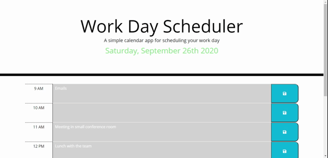

# Workday Planner
A simple planner that allows the user to save events for each hour of the day.

## Deployed Application
[Click here to go to the deployed app!](https://cwedwards9.github.io/day-planner/)

## Description
This planner allows the user to input and save events for each hour of a normal workday period. These events are saved to the local storage and when the user refreshes or visits the application at a later time in the day, they can see all of their saved events. It is as simple as typing out the event in the text area and clicking on the save button for the specific hour.

An hour that has passed in the workday is gray while any hour in the future is green. The current hour is an orange color.

## Libraries
* Bootstrap
* jQuery
* Moment.js

## Example

## License
MIT

## Contact Info
* Chase Edwards <chase.w.edwards9@gmail.com>