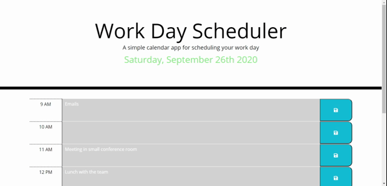

# day-planner
A simple calendar application that allows the user to save events for each hour of the day.

## Description
A user is able to save events for each hour of a normal work day period. These events are saved to the local storage and when the user refreshes or visits the application at a later time in the day, can see all of the saved events still on the page. It is as simple as typing out the event in the text area and clicking on the save button for the specific hour.

An hour that has passed in the work day is dynamically turned gray while any hour in the future is green. The current hour is an orange color.

## Libraries
    * Bootstrap
    * jQuery
    * Moment.js

## Example

